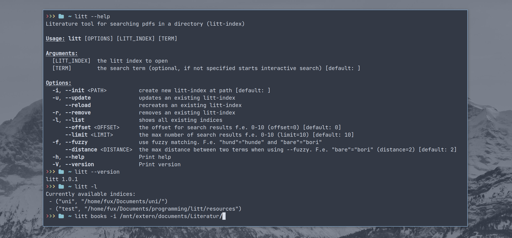
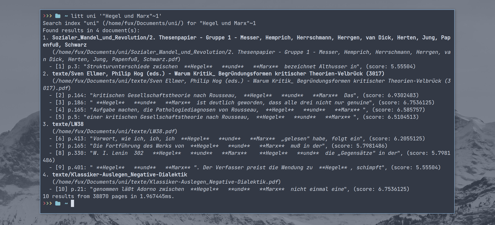
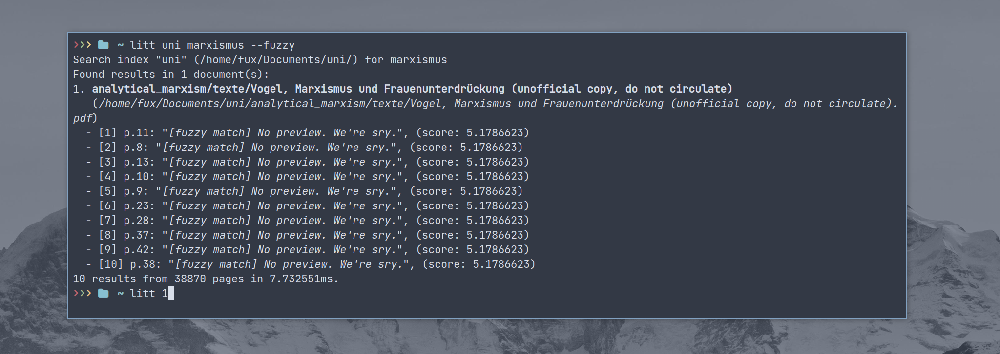

# Litt
Literature tool for searching all PDFs in a directory.

### tl;dr
**Installing (Download Prebuilt Artifact)**:

```sh
curl --proto '=https' --tlsv1.2 -LsSf https://github.com/georgbuechner/litt/releases/latest/download/litt-installer.sh | sh
```

**Installing (With Cargo/Local Build)**:

```sh
cargo install --git https://github.com/georgbuechner/litt
```

**Usage**:
```python
litt <index-name> -i <path-to-documents>  # create new index <index-name>
litt <index-name> <search-term>  # search for <search-term> in <index-name>
litt <index-name> # start interactive search
```

<p align="center">
  
</div>

# Table of contents
1. [litt](#litt)
2. [installation](#installation)
	1. [requirements](#requirements)
	2. [pre-built binaries](#prebuilt-binaries)
1. [usage](#usage)
    1. [create new Index](#create)
    2. [updating, reloading, deleting](#updating)
    3. [searching](#searching)
		- [exact matching](#exact-matching)
		- [fuzzy matching](#fuzzy-matching)
3. [Acknowledgements](#acknowledgements)


# Litt
Literature tool for searching all PDFs in a directory.

## Installation 

### Requirements
The command-line tool [pdftotext](https://www.xpdfreader.com/download.html) should be available on your system.

Also, we advise to install [zathura](https://pwmt.org/projects/zathura/installation/), a very lightweight pdf reader. If zathura is availible we can open the selected pdf (`litt <num>`) on the selected page and with the search term highlighted.

### Pre-built binaries.<a name="prebuilt-binaries"></a>
There are pre-built binaries available for Windows and Linux. 
Simply download the binary (see: *Releases*) and you are ready to go. 
It is advised to add `litt` to path. 

#### Linux 
This would be a way to go for Linux:
```
wget https://github.com/georgbuechner/litt/releases/download/v1.0.1/litt-ubuntu-latest 
chmod +x litt-ubuntu-latest
cp -f litt-ubuntu-latest /usr/local/bin/litt
```
- `wget` downloads the file (*make sure to change the version-number to the latest
version*). 
- `chmod +x` grants permission to execute `litt`. (This must be run as `sudo`
  user)
- `cp -f litt-ubuntu-latest /usr/local/bin/litt` makes `litt` available system wide under the name `litt`. 

Verify by running `litt --version`. It should show something like: 
```
litt 1.0.1
```

#### Windows 
Honestly, I don't really know. After downloading the [windows binary](https://github.com/georgbuechner/litt/releases), `litt` should be added
to path. This guide gives some explanation on how to do that: 
https://windowsloop.com/how-to-add-to-windows-path/

#### MacOS
Sadly there are no binarys available for MacOS. For installation see *Compile
from source*.

### Compile from source 
First you should install `Rust`/`Cargo`: https://www.rust-lang.org/tools/install 

Then clone the Github repository (in Windows we suggest using git-bash)
```
git clone https://github.com/georgbuechner/litt.git
```

Then run: 
```
cargo build --release 
```

Finally, make the release availible system-wide. 
In Linux f.e.: `cp -f target/release/litt /usr/local/bin`. 

## Usage 



### Create a new `litt`-index <a name="create"></a>
This is how you create a new index:
```
litt <index-name> -i <path-to-documents>
```
Assuming you have some documents stored at `Documets/Literature/books/` which you
would like to index, you can do this as following: 
```
litt books -i Documets/Literature/books/
```
*NOTE:*
- *the index-name can be any name. It need not match with the directory name.*
- *any relative path is automatically changed to an absolute path* (e.i.
  `Docuemts/Literature/books/` to `/home/<user>/Docuemts/Literature/books/`)

### Updating, reloading, deleting an existing index<a name="updating"></a>
To see all existing indices, type: 
```
litt -l 
> Currently available indices:
 - ("books", "/home/<user>/Documents/Literature/books/")
 - ("papers", "/home/<user>/Documents/papers/")
 - ("notes", "/home/<user>/Documents/notes/")
```
You can then update an existing index: `litt books -u` which is usually very
fast, but might not track all changes made to *existing* documents and will
never track *deleted* documents. Use `litt books --reload` to fully reload the
index. This might take a while. 

To delete an index, type: `litt books -r`

### Searching 
In general you search like this: 
```
litt <index-name> <search-term>
```
If your search term is more than one word, you should add quotations: `litt <index-name> '<term1 term2 ...>'`

Use `--offset` and `--limit` to show more results. (Default shows the top ten
results. `--offset 10` shows the first 10 to 20 results. `--offset 10 --limit 50`
shows the first 10 to 60 results).


Use `litt <num>` to open a document (num refers to the number in brackets, f.e.
`- [1] p. XXX: ...`)


**NOTE (open on wrong page):** Possibly the searched term was not found by
zathura since it breaks line, e.i: 
``` 
my- 
stifiziert 
``` 
Try to search for a substring to then find the term on the page. 
```
/my 
```


### Exact matching 
You can search for multiple words, the following will give the same result
```
litt books "Tulpen Rosen" 
litt books "Tulpen OR Rosen" 
```
And show all documents (pages) which contain the term `Tuplen` *or* `Rosen`. This 
```
litt books "Tulpen AND Rosen" 
```
will only show documents (pages) which contain *both* the term `Tulpen` *and*
the term `Rosen`.

You may also combine: 
```
litt books "(Tulpen AND Rosen) OR Narzisse" 
```

You can also search for fixed phrases: 
```
litt books '"Tulpen Narzisse"'
```
Or: 
```
litt books '"Tulpen Narzisse"~1'
```
which will also match f.e. `Tulpen wie Narzisse`.



Finally, you can find partial matches with: 
```
litt books '"Tulpen Narz"*'
```

A detailed listing of possible queries and also limitations can be found on the
`tantivy` page: https://docs.rs/tantivy/latest/tantivy/query/struct.QueryParser.html

### Fuzzy Matching 
Fuzzy matching can be helpful to find partial matches on single words (e.i.
match `nazis` when searching for `nazi`).
But also to correct typos or bad scans (e.i. find `nacis` when searching for
`nazis`). This can be done by using the `fuzzy` flag:
```
litt books nazis --fuzzy
```



You can also specify the distance the search and matched term may have
(default=2): 
```
litt books nazis --fuzzy --distance 2 
```

You may also search for multiple words:
```
litt books 'Tulp Narz' --fuzzy
```

**Note:**
- working with phrases (`litt books '"Tulpen Narzisse"~1'`) or `AND`/`OR`
does not work with fuzzy search
- In some cases no preview can be shown when using fuzzy search, we're working
  to improve this!
- fuzzy matching only works on the body, not the title.


## Acknowledgements

### Dependencies
We explicitly want to thank all the great developers who help write and maintain the
awesome libraries makeing `litt` possible:
- [tantivy](https://github.com/quickwit-oss/tantivy) the mind blowing full-text search engine library
- [clap](https://github.com/clap-rs/clap) the beautiful command line argument
  parser.
- [serde-json](https://github.com/serde-rs/json) for serializing and
  deserializing JSONs
- [shellexpand](https://github.com/netvl/shellexpand) for making our lives in a
  cross-platform world easier :)
- [uuid](https://github.com/uuid-rs/uuid) how would we (uniquely) identify each other
  without you? 
- [colored](https://github.com/colored-rs/colored) for making our output more
  colorful (even though it really isn't)
- [walkdir](https://github.com/BurntSushi/walkdir) for helping us gather all
  your documents
- [pdftotext](https://www.xpdfreader.com/pdftotext-man.html) which is amazingly
  good at doing its job)
- [rayon](https://github.com/rayon-rs/rayon) for parallelizing indexing and
  making it ~10 times faster!
- [levenshtein-rs](https://github.com/wooorm/levenshtein-rs) for allowing us to
  show atleast some previews for fuzzy search


We also want to clarify, that not all dependencies use the same license as we do:

| name | license |
|------|---------|
| clap | Apache-2.0, MIT |
| rayon | Apache-2.0, MIT |
| serde json | Apache-2.0, MIT |
| shellexpand | Apache-2.0, MIT |
| uuid | Apache-2.0, MIT |
| tantivy | MIT |
| walkdir | MIT |
| colored | MPL-2.0 |
